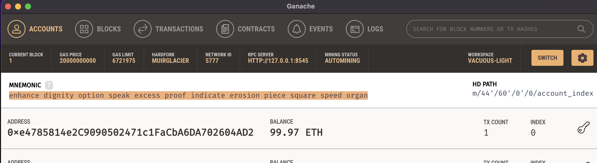
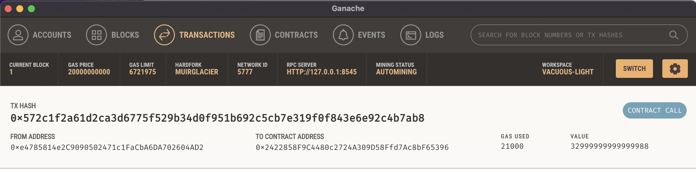

## Unit 19 Homework: Cryptocurrency Wallet

### Background

You work at a startup that is building a new and disruptive platform called Fintech Finder. Fintech Finder is an application that its customers can use to find fintech professionals from among a list of candidates, hire them, and pay them. As Fintech Finder’s lead developer, you have been tasked with integrating the Ethereum blockchain network into the application in order to enable your customers to instantly pay the fintech professionals whom they hire with cryptocurrency.

In this Challenge, you will complete the code that enables your customers to send cryptocurrency payments to fintech professionals. To develop the code and test it out, you will assume the perspective of a Fintech Finder customer who is using the application to find a fintech professional and pay them for their work.

### Submission

To complete this Challenge, I used two Python files:

1) The first file `fintech_finder.py` contained the code associated with the web interface of the application. This code is compatible with the Streamlit library. 

2) The second file  `crypto_wallet.py`contained the Ethereum transaction functions. 

By using import statements, the `crypto_wallet.py` Python script was integrated into the Fintech Finder interface program that is found in the `fintech_finder.py` file.

By integrating these two files I was able to automate the tasks associated with generating a digital wallet, accessing Ethereum account balances, and signing and sending transactions via a personal Ethereum blockchain called Ganache.

© 2021 Trilogy Education Services, a 2U, Inc. brand. All Rights Reserved.
